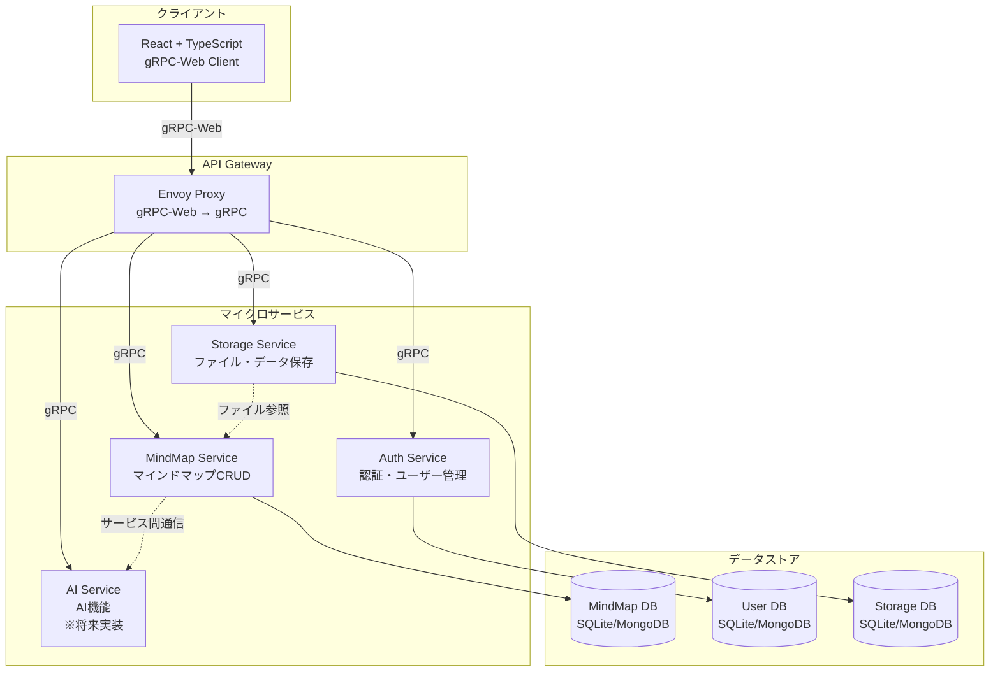
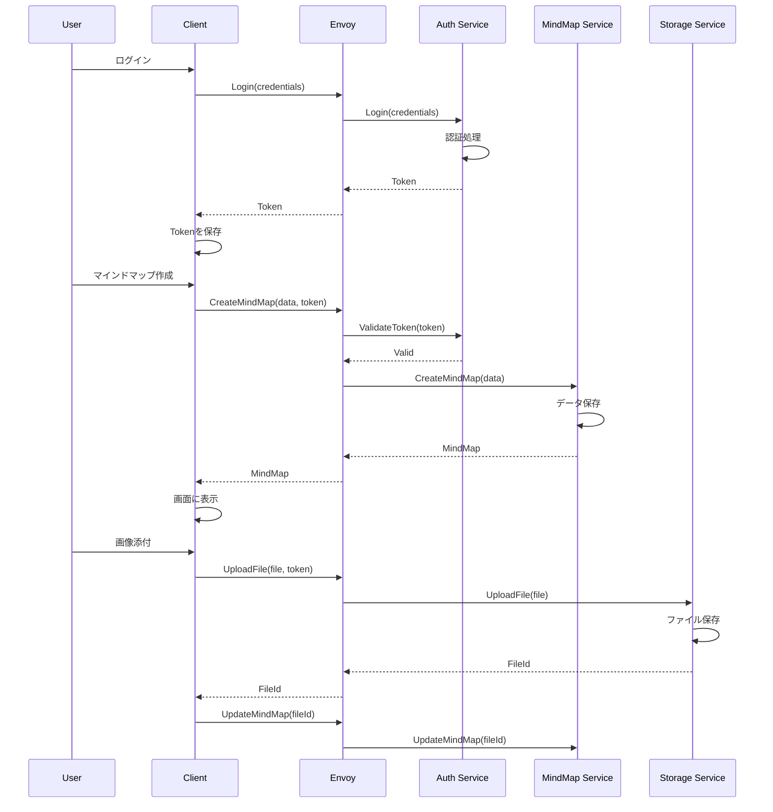
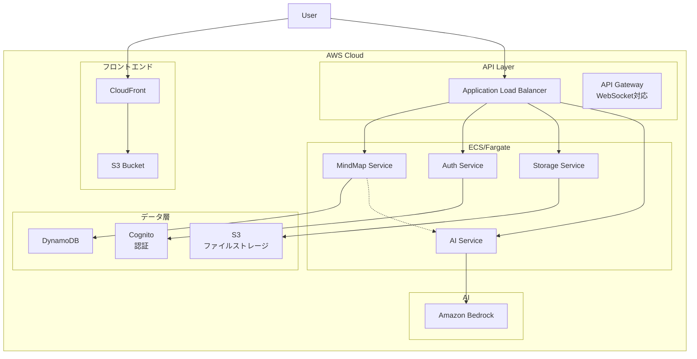
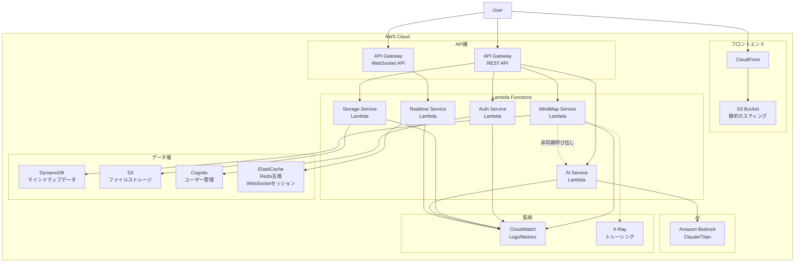
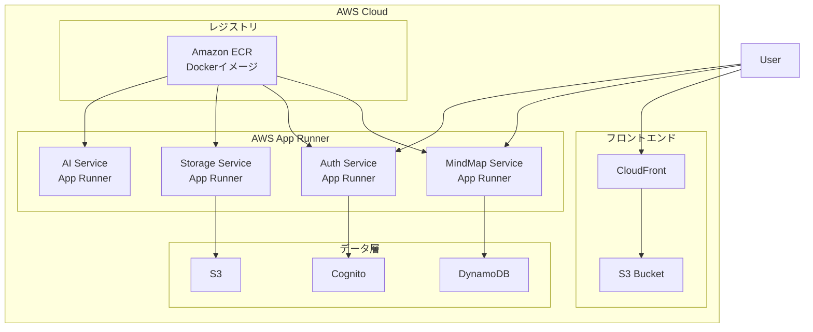
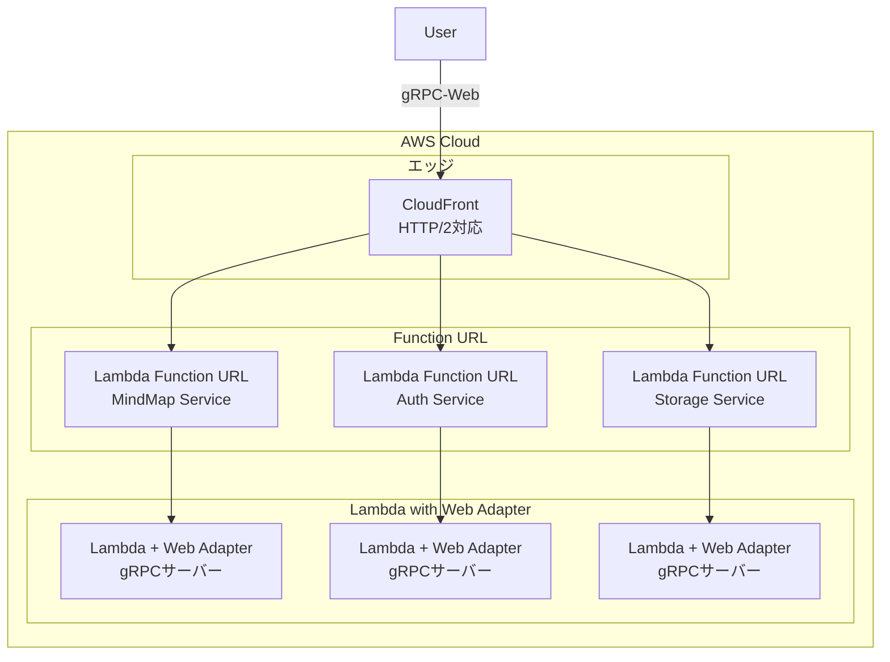
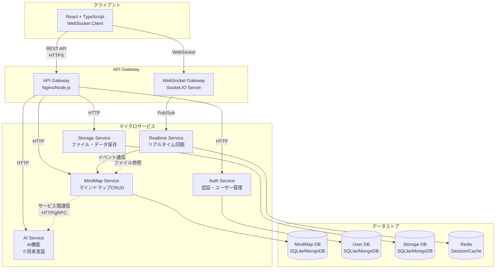
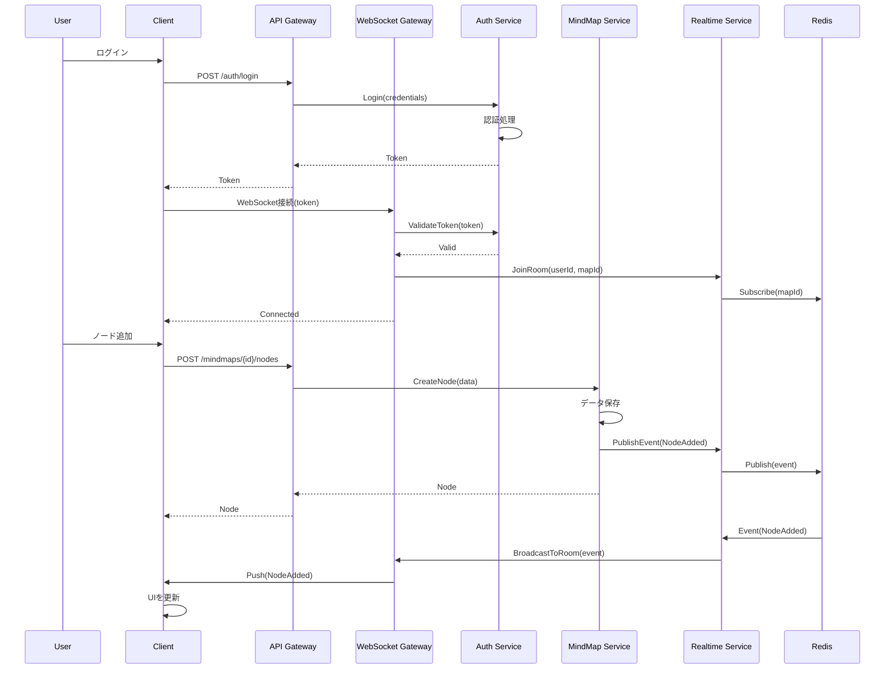

# MindMapアプリ アーキテクチャ設計

## システム全体構成(gRPC版)



## サービス詳細

### 1. MindMap Service

**責務**: マインドマップのCRUD操作

**API**:

- `CreateMindMap()` - 新規作成
- `GetMindMap()` - 取得
- `UpdateMindMap()` - 更新
- `DeleteMindMap()` - 削除
- `ListMindMaps()` - 一覧取得

**データ**: ノード、エッジ、位置情報、メタデータ

### 2. Auth Service

**責務**: ユーザー認証・認可

**API**:

- `Register()` - ユーザー登録
- `Login()` - ログイン
- `Logout()` - ログアウト
- `ValidateToken()` - トークン検証
- `RefreshToken()` - トークン更新

**データ**: ユーザー情報、認証トークン

### 3. Storage Service

**責務**: ファイル・添付データ管理

**API**:

- `UploadFile()` - ファイルアップロード
- `DownloadFile()` - ファイルダウンロード
- `DeleteFile()` - ファイル削除
- `ListFiles()` - ファイル一覧

**データ**: ファイルメタデータ、実ファイル

### 4. AI Service (将来実装)

**責務**: AI機能の提供

**API**:

- `GenerateMindMap()` - テキストからマインドマップ生成
- `SuggestNodes()` - ノード提案
- `SummarizeMap()` - マインドマップ要約
- `ExtractKeywords()` - キーワード抽出

**統合**: Amazon Bedrock / OpenAI API

## データフロー



## 技術スタック

### フロントエンド

- **フレームワーク**: React 18+ with TypeScript
- **ビルドツール**: Vite
- **状態管理**: Zustand
- **UI**: Tailwind CSS + shadcn/ui
- **マインドマップ描画**: ReactFlow
- **通信**: gRPC-Web (@grpc/grpc-js, @improbable-eng/grpc-web)

### バックエンド

- **ランタイム**: Node.js 20+ with TypeScript
- **フレームワーク**: NestJS (マイクロサービス対応)
- **通信**: gRPC (@grpc/grpc-js)
- **データベース**: MongoDB or SQLite
- **認証**: JWT

### インフラ (ローカル開発)

- **コンテナ**: Docker + Docker Compose
- **プロキシ**: Envoy (gRPC-Web対応)
- **開発サーバー**: hot-reload対応

## デプロイ構成 (AWS移行時)



## デプロイ構成 (サーバーレス版)

### パターン1: Lambda + API Gateway (推奨)



### パターン2: App Runner (Docker利用)



### パターン3: Lambda Web Adapter (gRPC対応)



## サーバーレス構成の詳細

### Lambda構成

#### 関数ごとの設定

```yaml
MindMapService:
    runtime: nodejs20.x
    handler: dist/index.handler
    memory: 512MB
    timeout: 30s
    environment:
        - TABLE_NAME: mindmaps
        - NODE_ENV: production
    layers:
        - TypeScriptLayer
        - SharedDependenciesLayer

AuthService:
    runtime: nodejs20.x
    handler: dist/index.handler
    memory: 256MB
    timeout: 10s
    environment:
        - USER_POOL_ID: xxx
        - JWT_SECRET: xxx

StorageService:
    runtime: nodejs20.x
    handler: dist/index.handler
    memory: 1024MB # ファイル処理用
    timeout: 60s
    environment:
        - BUCKET_NAME: mindmap-files
```

### API Gateway構成

#### REST API

```
GET    /mindmaps          → List MindMaps
POST   /mindmaps          → Create MindMap
GET    /mindmaps/{id}     → Get MindMap
PUT    /mindmaps/{id}     → Update MindMap
DELETE /mindmaps/{id}     → Delete MindMap

POST   /auth/register     → Register User
POST   /auth/login        → Login
POST   /auth/refresh      → Refresh Token

POST   /storage/upload    → Upload File
GET    /storage/{fileId}  → Download File
```

#### WebSocket API

```
$connect    → 接続確立、認証
$disconnect → 接続切断
$default    → デフォルトルート

subscribe   → マインドマップの購読開始
unsubscribe → 購読解除
update      → リアルタイム更新
```

### DynamoDB テーブル設計

#### MindMaps テーブル

```
PK: userId#mapId
SK: METADATA

属性:
- mapId
- userId
- title
- createdAt
- updatedAt
- nodes: JSON
- edges: JSON
```

#### WebSocketConnections テーブル

```
PK: connectionId
SK: timestamp

属性:
- userId
- mapId
- connectedAt
TTL: 24時間
```

### コスト試算 (月間)

**小規模利用（個人開発）**

- Lambda実行: 100万リクエスト/月 = $0.20
- API Gateway: 100万リクエスト = $3.50
- DynamoDB: 25GB書き込み/読み込み (無料枠) = $0
- S3: 5GB保存 + 10,000リクエスト = $0.15
- CloudFront: 10GB転送 (無料枠) = $0
- **合計: 約$4/月**

**中規模利用（100ユーザー）**

- Lambda実行: 1000万リクエスト/月 = $2
- API Gateway: 1000万リクエスト = $35
- DynamoDB: オンデマンド 100GB = $25
- S3: 50GB保存 = $1.15
- CloudFront: 100GB転送 = $8.50
- **合計: 約$72/月**

### サーバーレスのメリット

1. **コスト最適化**
    - 使った分だけ課金
    - アイドル時のコストほぼゼロ
    - 無料枠が大きい

2. **運用負荷ゼロ**
    - サーバー管理不要
    - パッチ適用自動
    - 自動スケール

3. **高可用性**
    - マルチAZ自動構成
    - 99.9%以上のSLA
    - 障害時の自動復旧

4. **開発速度**
    - インフラコード化（IaC）
    - CI/CDパイプライン容易
    - 迅速なデプロイ

### デプロイ方法

#### AWS SAM (推奨)

```yaml
# template.yaml
AWSTemplateFormatVersion: "2010-09-09"
Transform: AWS::Serverless-2016-10-31

Resources:
    MindMapFunction:
        Type: AWS::Serverless::Function
        Properties:
            CodeUri: services/mindmap/
            Handler: index.handler
            Runtime: nodejs20.x
            Events:
                Api:
                    Type: Api
                    Properties:
                        Path: /mindmaps
                        Method: any
```

```bash
sam build
sam deploy --guided
```

#### AWS CDK (TypeScript)

```typescript
import * as lambda from "aws-cdk-lib/aws-lambda";
import * as apigateway from "aws-cdk-lib/aws-apigateway";

const mindMapFunction = new lambda.Function(this, "MindMapFunction", {
	runtime: lambda.Runtime.NODEJS_20_X,
	handler: "index.handler",
	code: lambda.Code.fromAsset("dist"),
});

const api = new apigateway.RestApi(this, "MindMapAPI");
api.root
	.addResource("mindmaps")
	.addMethod("GET", new apigateway.LambdaIntegration(mindMapFunction));
```

#### Serverless Framework

```yaml
# serverless.yml
service: mindmap-app

provider:
    name: aws
    runtime: nodejs20.x
    region: ap-northeast-1

functions:
    mindmap:
        handler: services/mindmap/index.handler
        events:
            - http:
                  path: mindmaps
                  method: any
```

### ECS/Fargate vs サーバーレス比較

| 項目                 | ECS/Fargate          | Lambda + API Gateway    |
| -------------------- | -------------------- | ----------------------- |
| **起動時間**         | 1-2分                | 数秒〜数百ms            |
| **最小コスト**       | $30-40/月            | $0（無料枠内）          |
| **実行時間制限**     | なし                 | 15分（Lambda）          |
| **長時間処理**       | ◎                    | △（Step Functions併用） |
| **WebSocket**        | ◎                    | ◎（API Gateway対応）    |
| **gRPC**             | ◎                    | ○（Web Adapter使用）    |
| **学習コスト**       | 中                   | 低                      |
| **コールドスタート** | なし                 | あり（対策可能）        |
| **推奨用途**         | 常時稼働、長時間処理 | 断続的、短時間処理      |

## セキュリティ設計

### 認証・認可

- JWT (JSON Web Token) による認証
- Token有効期限: 1時間
- Refresh Token: 7日間
- 各リクエストでTokenを検証

### 通信

- ローカル: HTTP (開発用)
- 本番: HTTPS/TLS 1.3
- gRPC over TLS

### データ保護

- パスワード: bcrypt でハッシュ化
- 機密データ: 暗号化保存
- CORS設定: 必要なオリジンのみ許可

## スケーラビリティ

### 水平スケーリング

- 各マイクロサービスは独立してスケール可能
- ステートレス設計
- ロードバランサーで負荷分散

### キャッシング

- Redis (将来追加)
- API レスポンスキャッシュ
- 静的ファイルCDN配信

## 開発フェーズ

### Phase 1: MVP (現在)

- ✅ アーキテクチャ設計
- ⬜ プロジェクトセットアップ
- ⬜ proto定義
- ⬜ MindMap Service 基本機能
- ⬜ Auth Service 基本機能
- ⬜ Storage Service 基本機能
- ⬜ フロントエンド基本UI

### Phase 2: 機能拡張

- ⬜ リアルタイム同期
- ⬜ 複数ユーザー対応
- ⬜ エクスポート機能 (PNG, PDF, JSON)

### Phase 3: AI統合

- ⬜ AI Service 実装
- ⬜ Amazon Bedrock 統合
- ⬜ 自動生成機能
- ⬜ 提案機能

### Phase 4: AWS移行

- ⬜ ECS/Fargate デプロイ
- ⬜ DynamoDB 移行
- ⬜ S3 + CloudFront
- ⬜ CI/CD パイプライン

## システム全体構成(WebSocket版)



## WebSocket版の特徴

### 通信方式

- **REST API**: CRUD操作（GET, POST, PUT, DELETE）
- **WebSocket**: リアルタイム更新、コラボレーション機能
- **Pub/Sub**: Redisを使ったイベント配信

### リアルタイム機能

- マインドマップの変更を複数クライアントに即座に同期
- Socket.IOによる自動再接続
- ルームベースの接続管理

### データフロー (WebSocket版)



## gRPC vs WebSocket 比較

| 特徴               | gRPC                      | WebSocket                  |
| ------------------ | ------------------------- | -------------------------- |
| **学習コスト**     | 高（proto定義必要）       | 低（標準的なAPI）          |
| **型安全性**       | 強い（protoから自動生成） | 弱い（手動で型定義）       |
| **ブラウザ対応**   | gRPC-Web + Proxyが必要    | ネイティブサポート         |
| **セットアップ**   | 複雑（Envoy等）           | シンプル                   |
| **リアルタイム**   | Server Streaming          | 双方向通信（標準）         |
| **パフォーマンス** | 高速（バイナリ）          | 良好（テキスト/バイナリ）  |
| **サービス間通信** | 最適                      | HTTP/RESTで代替            |
| **AWS移行**        | ECS/EKSで容易             | API Gateway対応            |
| **推奨用途**       | 大規模、多サービス        | 中小規模、リアルタイム重視 |

## 推奨アプローチ

### 初期実装: WebSocket

- 学習コストが低い
- セットアップが簡単
- リアルタイム機能が標準

### 将来的な移行: gRPC (オプション)

- サービス数が増えた時
- 型安全性を強化したい時
- マイクロサービスが複雑化した時

または**ハイブリッド**:

- クライアント↔Gateway: REST + WebSocket
- サービス間通信: gRPC
