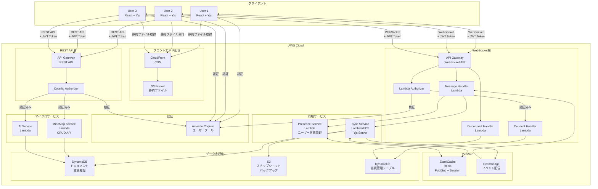
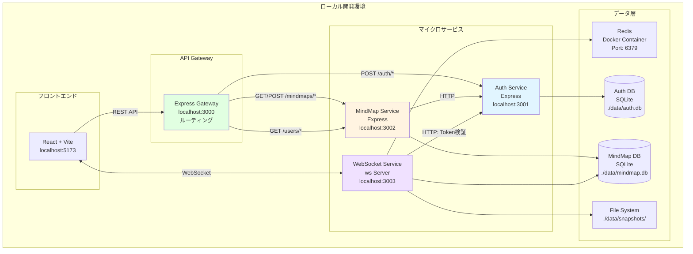

# MindMapアプリ アーキテクチャ設計

## AWS本番環境アーキテクチャ



### AWS認証機能の詳細

#### Amazon Cognito構成

**ユーザープール設定**

- **認証フロー**: USER_PASSWORD_AUTH（ユーザー名・パスワード）
- **MFA**: オプション（SMS/TOTP対応）
- **パスワードポリシー**:
    - 最小8文字
    - 大文字・小文字・数字・記号を含む
- **トークン有効期限**:
    - ID Token: 1時間
    - Access Token: 1時間
    - Refresh Token: 30日

**アプリクライアント設定**

- **認証フロー**: ALLOW_USER_PASSWORD_AUTH, ALLOW_REFRESH_TOKEN_AUTH
- **OAuth 2.0**: サポート（将来のソーシャルログイン用）
- **カスタム属性**:
    - `custom:displayName` - 表示名
    - `custom:avatarUrl` - アバターURL

#### API Gateway Cognito Authorizer

```typescript
// REST APIエンドポイントの認証設定
{
  "/mindmaps": {
    "GET": { "authorizer": "CognitoUserPoolAuthorizer" },
    "POST": { "authorizer": "CognitoUserPoolAuthorizer" }
  },
  "/mindmaps/{mapId}": {
    "GET": { "authorizer": "CognitoUserPoolAuthorizer" },
    "PUT": { "authorizer": "CognitoUserPoolAuthorizer" },
    "DELETE": { "authorizer": "CognitoUserPoolAuthorizer" }
  }
}
```

#### WebSocket Lambda Authorizer

```typescript
// lambda-authorizer.ts
import { CognitoJwtVerifier } from "aws-jwt-verify";

const verifier = CognitoJwtVerifier.create({
	userPoolId: process.env.COGNITO_USER_POOL_ID!,
	tokenUse: "id",
	clientId: process.env.COGNITO_CLIENT_ID!,
});

export const handler = async (event) => {
	try {
		const token = event.queryStringParameters?.token;
		const payload = await verifier.verify(token);

		return {
			principalId: payload.sub,
			policyDocument: {
				Version: "2012-10-17",
				Statement: [
					{
						Action: "execute-api:Invoke",
						Effect: "Allow",
						Resource: event.methodArn,
					},
				],
			},
			context: {
				userId: payload.sub,
				email: payload.email,
			},
		};
	} catch (error) {
		throw new Error("Unauthorized");
	}
};
```

#### フロントエンド認証フロー

```typescript
// auth.ts
import {
	CognitoUserPool,
	CognitoUser,
	AuthenticationDetails,
} from "amazon-cognito-identity-js";

const userPool = new CognitoUserPool({
	UserPoolId: process.env.VITE_COGNITO_USER_POOL_ID!,
	ClientId: process.env.VITE_COGNITO_CLIENT_ID!,
});

// ログイン
export const signIn = async (email: string, password: string) => {
	const user = new CognitoUser({ Username: email, Pool: userPool });
	const authDetails = new AuthenticationDetails({
		Username: email,
		Password: password,
	});

	return new Promise((resolve, reject) => {
		user.authenticateUser(authDetails, {
			onSuccess: (session) =>
				resolve({
					idToken: session.getIdToken().getJwtToken(),
					accessToken: session.getAccessToken().getJwtToken(),
					refreshToken: session.getRefreshToken().getToken(),
				}),
			onFailure: (err) => reject(err),
		});
	});
};

// API呼び出し時の認証ヘッダー自動付与
apiClient.interceptors.request.use(async (config) => {
	const session = await getCurrentSession();
	if (session) {
		config.headers.Authorization = `Bearer ${session.idToken}`;
	}
	return config;
});
```

#### DynamoDBテーブル設計

**UsersTable**

```
PK: userId (Cognito sub)
Attributes:
- userId: string
- email: string
- displayName: string
- avatarUrl: string
- createdAt: timestamp
```

**UserMapsTable**

```
PK: userId
SK: mapId
Attributes:
- role: string (owner | editor | viewer)
- createdAt: timestamp
```

## ローカル開発環境アーキテクチャ

### 設計方針

AWS移行を見据えたローカル開発環境を構築します。以下の原則に従います：

1. **サービス層の分離**: 各機能をサービスとして分離し、AWS Lambdaへの移行を容易に
2. **同一API設計**: REST/WebSocket APIのエンドポイント設計をAWSと同じに
3. **環境変数による切り替え**: ローカル/AWS環境を環境変数で切り替え
4. **TypeScript統一**: フロントエンド・バックエンド共にTypeScriptで実装

### ローカル版システム構成（マイクロサービス分散版）



### ローカル版技術スタック

#### フロントエンド（AWSと共通）

```json
{
	"name": "mindmap-frontend",
	"dependencies": {
		"react": "^18.2.0",
		"reactflow": "^11.10.0",
		"yjs": "^13.6.0",
		"y-websocket": "^1.5.0",
		"y-indexeddb": "^9.0.11",
		"zustand": "^4.4.0",
		"tailwindcss": "^3.3.0",
		"axios": "^1.6.0"
	},
	"devDependencies": {
		"vite": "^5.0.0",
		"@vitejs/plugin-react": "^4.2.0",
		"typescript": "^5.3.0"
	}
}
```

#### バックエンド（ローカル版）

```json
{
	"name": "mindmap-backend",
	"dependencies": {
		"express": "^4.18.0",
		"ws": "^8.14.0",
		"yjs": "^13.6.0",
		"ioredis": "^5.3.0",
		"better-sqlite3": "^9.2.0",
		"jsonwebtoken": "^9.0.2",
		"bcrypt": "^5.1.1",
		"cors": "^2.8.5",
		"dotenv": "^16.3.0",
		"uuid": "^9.0.1"
	},
	"devDependencies": {
		"typescript": "^5.3.0",
		"@types/express": "^4.17.21",
		"@types/ws": "^8.5.10",
		"@types/node": "^20.10.0",
		"tsx": "^4.7.0",
		"nodemon": "^3.0.2"
	}
}
```

### プロジェクト構造

```
MindMapApp/
├── frontend/                           # Reactフロントエンド
│   ├── src/
│   │   ├── components/
│   │   │   ├── MindMap/
│   │   │   │   ├── MindMapEditor.tsx
│   │   │   │   ├── MindMapCollaboration.tsx
│   │   │   │   └── Cursor.tsx
│   │   │   ├── Auth/
│   │   │   │   ├── Login.tsx
│   │   │   │   └── Register.tsx
│   │   │   └── Layout/
│   │   ├── hooks/
│   │   │   ├── useMindMap.ts
│   │   │   ├── useAuth.ts
│   │   │   └── useCollaboration.ts
│   │   ├── lib/
│   │   │   ├── api.ts              # REST APIクライアント
│   │   │   ├── websocket.ts        # WebSocketクライアント
│   │   │   └── yjs.ts              # Yjs設定
│   │   ├── stores/
│   │   │   ├── authStore.ts
│   │   │   └── mindmapStore.ts
│   │   ├── App.tsx
│   │   └── main.tsx
│   ├── package.json
│   ├── tsconfig.json
│   ├── vite.config.ts
│   └── Dockerfile
│
├── services/
│   ├── api-gateway/                    # API Gateway (Port 3000)
│   │   ├── src/
│   │   │   ├── index.ts
│   │   │   ├── proxy.ts            # 各サービスへプロキシ
│   │   │   └── routes.ts
│   │   ├── package.json
│   │   ├── tsconfig.json
│   │   ├── .env.example
│   │   └── Dockerfile
│   │
│   ├── auth-service/                   # 認証サービス (Port 3001)
│   │   ├── src/
│   │   │   ├── index.ts            # サーバーエントリーポイント
│   │   │   ├── routes.ts           # APIルート
│   │   │   ├── services/
│   │   │   │   └── auth.service.ts
│   │   │   ├── repositories/
│   │   │   │   └── user.repository.ts
│   │   │   ├── middleware/
│   │   │   │   └── error.middleware.ts
│   │   │   ├── utils/
│   │   │   │   └── jwt.ts
│   │   │   └── config/
│   │   │       └── database.ts
│   │   ├── package.json
│   │   ├── tsconfig.json
│   │   ├── .env.example
│   │   └── Dockerfile
│   │
│   ├── mindmap-service/                # マインドマップサービス (Port 3002)
│   │   ├── src/
│   │   │   ├── index.ts
│   │   │   ├── routes.ts
│   │   │   ├── services/
│   │   │   │   └── mindmap.service.ts
│   │   │   ├── repositories/
│   │   │   │   └── mindmap.repository.ts
│   │   │   ├── middleware/
│   │   │   │   ├── auth.middleware.ts  # Auth Serviceと通信
│   │   │   │   └── error.middleware.ts
│   │   │   ├── clients/
│   │   │   │   └── auth.client.ts  # Auth Service呼び出し
│   │   │   └── config/
│   │   │       └── database.ts
│   │   ├── package.json
│   │   ├── tsconfig.json
│   │   ├── .env.example
│   │   └── Dockerfile
│   │
│   └── websocket-service/              # WebSocketサービス (Port 3003)
│       ├── src/
│       │   ├── index.ts
│       │   ├── handlers/
│       │   │   ├── connection.handler.ts
│       │   │   ├── message.handler.ts
│       │   │   └── disconnect.handler.ts
│       │   ├── services/
│       │   │   ├── sync.service.ts
│       │   │   └── presence.service.ts
│       │   ├── repositories/
│       │   │   ├── mindmap.repository.ts
│       │   │   └── redis.repository.ts
│       │   ├── clients/
│       │   │   └── auth.client.ts  # Auth Service呼び出し
│       │   └── config/
│       │       └── database.ts
│       ├── package.json
│       ├── tsconfig.json
│       ├── .env.example
│       └── Dockerfile
│
├── shared/                             # 共通型定義・ユーティリティ
│   ├── types/
│   │   ├── user.ts
│   │   ├── mindmap.ts
│   │   └── api.ts
│   ├── utils/
│   │   └── logger.ts
│   ├── package.json
│   └── tsconfig.json
│
├── data/                               # ローカルデータ（gitignore）
│   ├── auth.db                     # 認証サービスDB
│   ├── mindmap.db                  # マインドマップサービスDB
│   └── snapshots/                  # Yjsスナップショット
│
├── docker/
│   └── docker-compose.yml          # 全サービス定義
│
├── scripts/
│   ├── start-all.sh                # 全サービス起動スクリプト
│   └── stop-all.sh                 # 全サービス停止スクリプト
│
├── package.json                        # ルートスクリプト
└── README.md
```

### Docker Compose設定

```yaml
# docker-compose.yml
version: "3.8"

services:
    # Redis
    redis:
        image: redis:7-alpine
        ports:
            - "6379:6379"
        volumes:
            - redis-data:/data
        networks:
            - mindmap-network

    # API Gateway
    api-gateway:
        build: ./services/api-gateway
        ports:
            - "3000:3000"
        environment:
            - PORT=3000
            - AUTH_SERVICE_URL=http://auth-service:3001
            - MINDMAP_SERVICE_URL=http://mindmap-service:3002
        depends_on:
            - auth-service
            - mindmap-service
        networks:
            - mindmap-network
        volumes:
            - ./services/api-gateway:/app
            - /app/node_modules

    # Auth Service
    auth-service:
        build: ./services/auth-service
        ports:
            - "3001:3001"
        environment:
            - PORT=3001
            - NODE_ENV=development
            - JWT_SECRET=your-secret-key
            - JWT_REFRESH_SECRET=your-refresh-secret
            - DB_PATH=./data/auth.db
        networks:
            - mindmap-network
        volumes:
            - ./services/auth-service:/app
            - ./data:/app/data
            - /app/node_modules

    # MindMap Service
    mindmap-service:
        build: ./services/mindmap-service
        ports:
            - "3002:3002"
        environment:
            - PORT=3002
            - NODE_ENV=development
            - AUTH_SERVICE_URL=http://auth-service:3001
            - DB_PATH=./data/mindmap.db
        depends_on:
            - auth-service
        networks:
            - mindmap-network
        volumes:
            - ./services/mindmap-service:/app
            - ./data:/app/data
            - /app/node_modules

    # WebSocket Service
    websocket-service:
        build: ./services/websocket-service
        ports:
            - "3003:3003"
        environment:
            - PORT=3003
            - NODE_ENV=development
            - AUTH_SERVICE_URL=http://auth-service:3001
            - REDIS_HOST=redis
            - REDIS_PORT=6379
            - DB_PATH=./data/mindmap.db
        depends_on:
            - redis
            - auth-service
        networks:
            - mindmap-network
        volumes:
            - ./services/websocket-service:/app
            - ./data:/app/data
            - /app/node_modules

    # Frontend
    frontend:
        build: ./frontend
        ports:
            - "5173:5173"
        environment:
            - VITE_API_URL=http://localhost:3000/api
            - VITE_WS_URL=ws://localhost:3003
        depends_on:
            - api-gateway
        networks:
            - mindmap-network
        volumes:
            - ./frontend:/app
            - /app/node_modules

volumes:
    redis-data:
```

### セットアップ手順

#### Docker Composeで起動

```bash
# 全サービスをDocker Composeで起動
docker-compose up --build

# バックグラウンドで起動
docker-compose up -d

# ログ確認
docker-compose logs -f

# 停止
docker-compose down
```

#### ローカル開発（Docker不使用）

各サービスを個別に起動する場合：

```bash
# ルートディレクトリで依存関係インストール
npm install

# 各サービスのセットアップ
cd services/auth-service && npm install && cd ../..
cd services/mindmap-service && npm install && cd ../..
cd services/websocket-service && npm install && cd ../..
cd services/api-gateway && npm install && cd ../..
cd frontend && npm install && cd ..

# Redisを起動（Docker）
docker run -d -p 6379:6379 redis:7-alpine

# 各サービスを別ターミナルで起動
# ターミナル1: Auth Service
cd services/auth-service
npm run dev

# ターミナル2: MindMap Service
cd services/mindmap-service
npm run dev

# ターミナル3: WebSocket Service
cd services/websocket-service
npm run dev

# ターミナル4: API Gateway
cd services/api-gateway
npm run dev

# ターミナル5: Frontend
cd frontend
npm run dev
```

#### 3. 一括起動スクリプト（推奨）

ルートの`package.json`にスクリプトを追加：

```json
{
	"scripts": {
		"dev:auth": "cd services/auth-service && npm run dev",
		"dev:mindmap": "cd services/mindmap-service && npm run dev",
		"dev:ws": "cd services/websocket-service && npm run dev",
		"dev:gateway": "cd services/api-gateway && npm run dev",
		"dev:frontend": "cd frontend && npm run dev",
		"dev:all": "concurrently \"npm:dev:*\"",
		"docker:up": "docker-compose up --build",
		"docker:down": "docker-compose down"
	},
	"devDependencies": {
		"concurrently": "^8.2.0"
	}
}
```

```bash
# 全サービス一括起動
npm run dev:all
```

#### 4. 動作確認

```bash
# ヘルスチェック
curl http://localhost:3000/health  # API Gateway
curl http://localhost:3001/health  # Auth Service
curl http://localhost:3002/health  # MindMap Service

# フロントエンド
open http://localhost:5173
```

### 環境変数設定例

#### services/api-gateway/.env

```env
NODE_ENV=development
PORT=3000
AUTH_SERVICE_URL=http://localhost:3001
MINDMAP_SERVICE_URL=http://localhost:3002
CORS_ORIGIN=http://localhost:5173
```

#### services/auth-service/.env

```env
NODE_ENV=development
PORT=3001
JWT_SECRET=your-secret-key-change-in-production
JWT_REFRESH_SECRET=your-refresh-secret-key-change-in-production
DB_PATH=./data/auth.db
CORS_ORIGIN=*
```

#### services/mindmap-service/.env

```env
NODE_ENV=development
PORT=3002
AUTH_SERVICE_URL=http://localhost:3001
DB_PATH=./data/mindmap.db
CORS_ORIGIN=*
```

#### services/websocket-service/.env

```env
NODE_ENV=development
PORT=3003
AUTH_SERVICE_URL=http://localhost:3001
REDIS_HOST=localhost
REDIS_PORT=6379
DB_PATH=./data/mindmap.db
```

#### frontend/.env

```env
VITE_API_URL=http://localhost:3000/api
VITE_WS_URL=ws://localhost:3003
```

## サービス間通信の学習ポイント

### 1. HTTPによるサービス間通信

各サービスが独立しているため、サービス間はHTTPで通信：

```typescript
// MindMap ServiceからAuth Serviceを呼び出し
const response = await axios.post(
	"http://localhost:3001/verify",
	{},
	{ headers: { Authorization: `Bearer ${token}` } },
);
```

### 2. API Gatewayパターン

フロントエンドは1つのエンドポイントに接続し、Gatewayがルーティング：

```
Frontend → API Gateway (3000) → Auth Service (3001)
                               → MindMap Service (3002)
```

### 3. サービスディスカバリー

Docker Composeではサービス名で解決：

```yaml
AUTH_SERVICE_URL=http://auth-service:3001  # Dockerネットワーク内
AUTH_SERVICE_URL=http://localhost:3001     # ローカル開発
```

### 4. 分散トレーシング

各サービスでリクエストIDを付けてログ追跡：

```typescript
// リクエストIDをヘッダーで伝播
const requestId = req.headers["x-request-id"] || uuidv4();
logger.info({ requestId, service: "auth-service", action: "login" });
```

## 開発フェーズ（ローカル→AWS移行版）

### Phase 1: ローカル基本機能 (2-3週間)

- ⬜ プロジェクト構造セットアップ
- ⬜ React + ReactFlowセットアップ
- ⬜ Express + WebSocketサーバー構築
- ⬜ 基本的なマインドマップUI
- ⬜ ローカル保存（IndexedDB + SQLite）

### Phase 2: ローカルYjs統合 (2週間)

- ⬜ Yjsセットアップ
- ⬜ マインドマップデータのCRDT化
- ⬜ ローカルWebSocketでの同期確認
- ⬜ Redis Pub/Sub統合

### Phase 3: ローカルコラボレーション機能 (2週間)

- ⬜ プレゼンス機能実装
- ⬜ アクティブユーザー表示
- ⬜ カーソル共有
- ⬜ 複数タブでのテスト

### Phase 4: 認証・永続化 (1-2週間)

- ⬜ JWT認証実装
- ⬜ ユーザー登録・ログイン
- ⬜ マインドマップCRUD API
- ⬜ スナップショット機能

### Phase 5: AWS移行準備 (1週間)

- ⬜ サービス層のAWS Lambda化準備
- ⬜ Repository層の抽象化（DynamoDB対応）
- ⬜ 環境変数による切り替え実装
- ⬜ IaCコード作成（CDK/Terraform）

### Phase 6: AWS移行 (2-3週間)

- ⬜ DynamoDB/ElastiCache構築
- ⬜ Lambda関数デプロイ
- ⬜ API Gateway設定
- ⬜ CloudFront + S3設定
- ⬜ 本番環境テスト

### Phase 7: セキュリティ・本番化 (1-2週間)

- ⬜ レート制限
- ⬜ 監視・ロギング（CloudWatch）
- ⬜ パフォーマンス最適化
- ⬜ 本番デプロイ

**ローカル開発期間: 約7-9週間**  
**AWS移行期間: 約3-5週間**  
**総開発期間: 約10-14週間**

## 参考リソース

### Yjs関連

- [Yjs Documentation](https://docs.yjs.dev/)
- [y-websocket](https://github.com/yjs/y-websocket)
- [y-indexeddb](https://github.com/yjs/y-indexeddb)

### AWS関連

- [API Gateway WebSocket API](https://docs.aws.amazon.com/apigateway/latest/developerguide/apigateway-websocket-api.html)
- [ElastiCache for Redis](https://aws.amazon.com/elasticache/redis/)
- [DynamoDB Best Practices](https://docs.aws.amazon.com/amazondynamodb/latest/developerguide/best-practices.html)

### 参考実装

- [Tldraw](https://github.com/tldraw/tldraw) - コラボレーティブホワイトボード
- [BlockNote](https://github.com/TypeCellOS/BlockNote) - コラボレーティブエディタ
